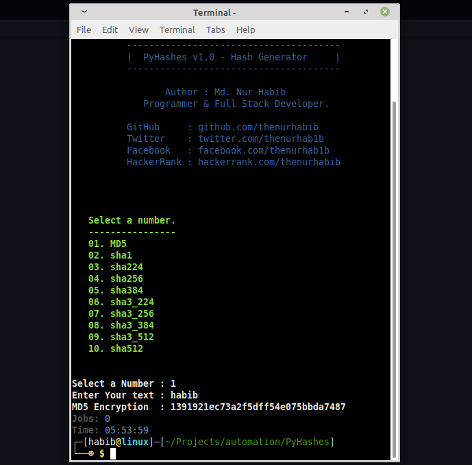

# PyHases - Hash Generator.

### Generate different types of hash of any string.


## Usage.
### <u> linux </u>

```yaml
 apt-get update
 apt-get upgrade
 pkg install git
 pkg install python3
 git clone https://github.com/thenurhabib/pyhases
 cd pyhases
 python3 pyhases.py

```
### <u> Termux </u>

```yaml
 apt-get update
 apt-get upgrade
 apt install git
 apt install python3
 git clone https://github.com/thenurhabib/pyhases
 cd pyhases
 python pyhases.py

```


## Screenshot




## 🔗 Links
[](https://www.nurhabib.ml/)
[](https://twitter.com/mdnurhab1b)
[](https://hackerrank.com/thenurhabib)

## 🚀 About Me
I'm a programmer and Linux System Administrator.


## Author

```yaml
 GitHub     : github.com/thenurhabib
 Twitter    : twitter.com/mdnurhab1b
 Facebook   : facebook.com?thenurhab1b 
 HackerRank : hackerrank.com/thenurhabib
```
<br>


# <strong> <center> Thank You. </center> <strong>
